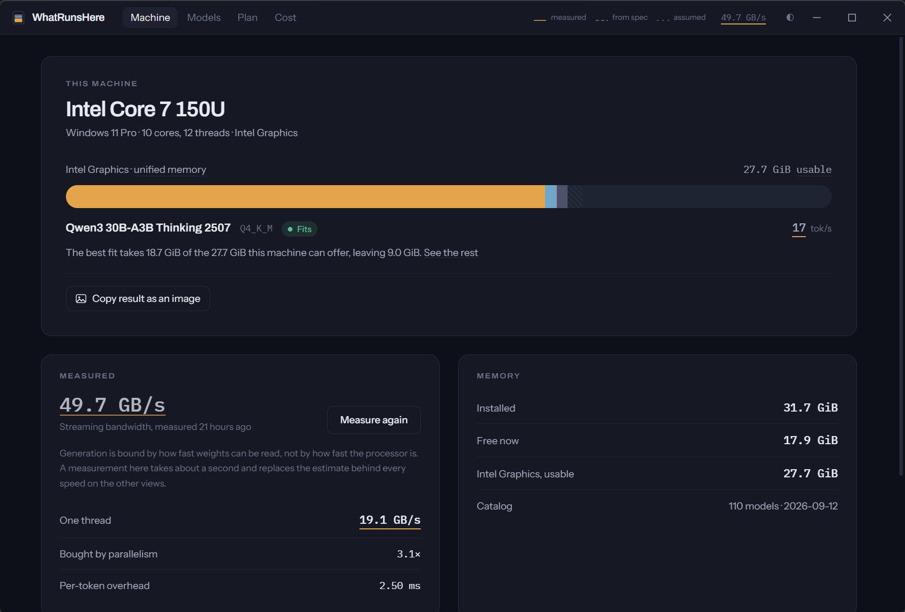
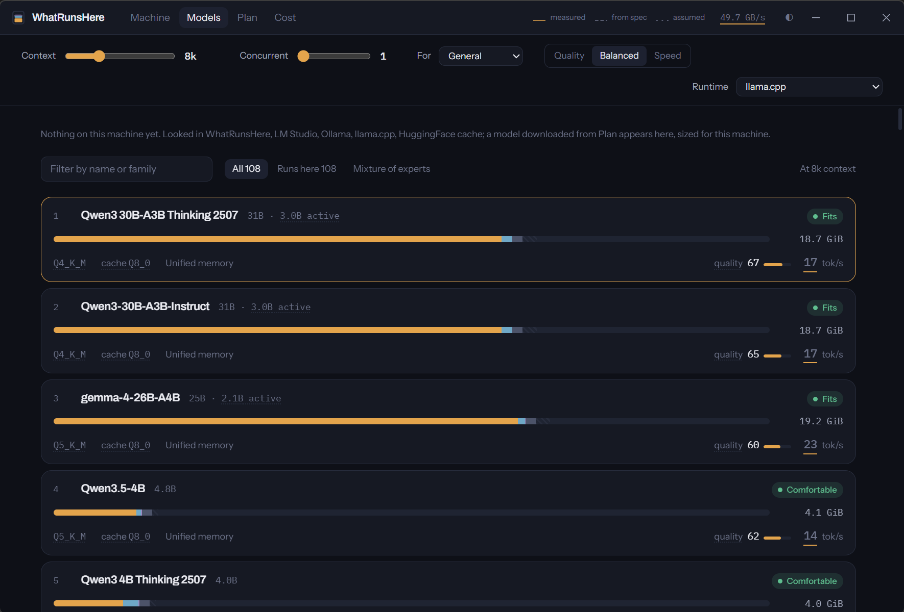
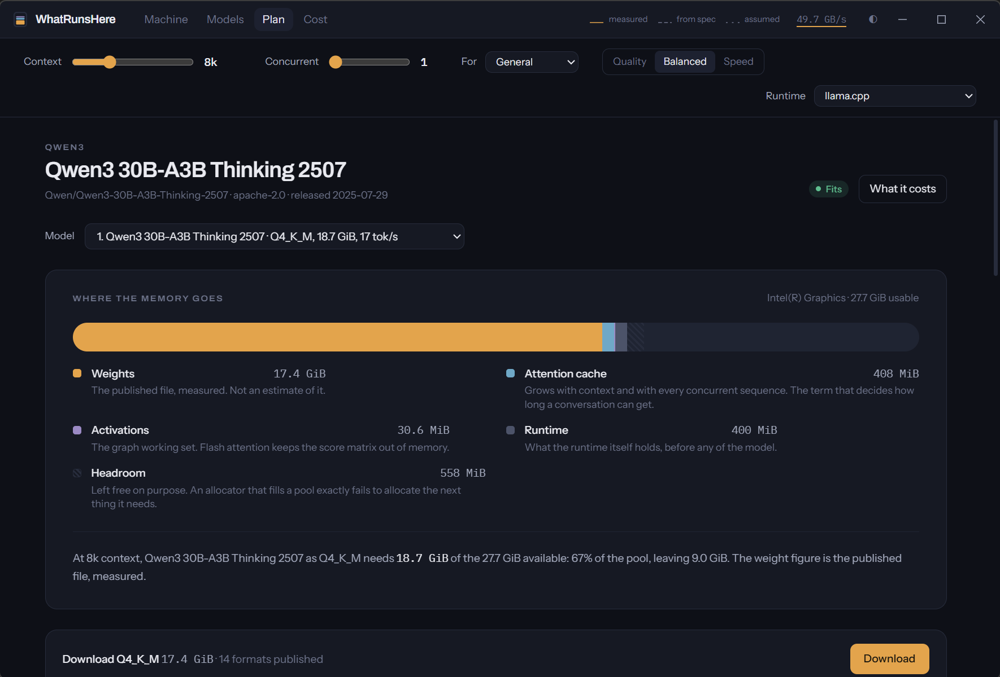
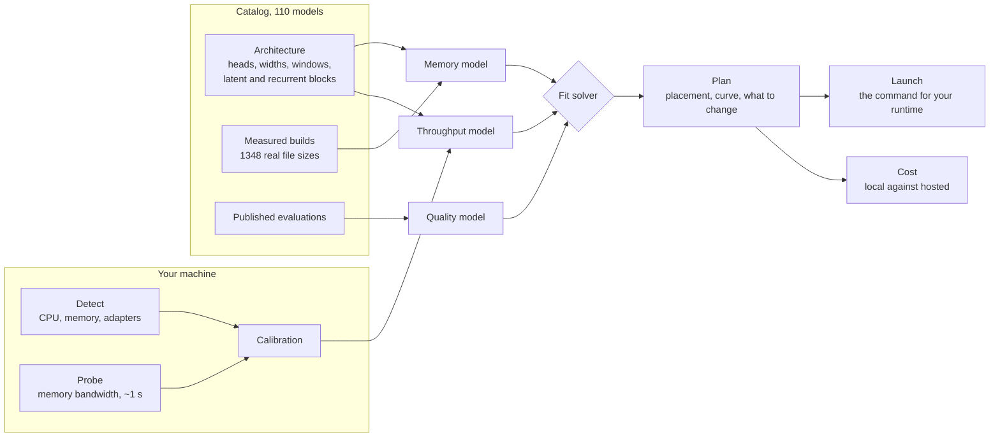

<div align="center">


# WhatRunsHere

**Which language models will actually run well on your machine.**<br>
Measured, not looked up.

[](https://github.com/EuBa-Code/WhatRunsHere/actions/workflows/ci.yml)
[](https://github.com/EuBa-Code/WhatRunsHere/actions/workflows/catalog.yml)
[](catalog/catalog.json)
[](https://github.com/EuBa-Code/WhatRunsHere/releases/latest)
[](https://github.com/EuBa-Code/WhatRunsHere/releases)
[](#licence)


[**Download**](https://github.com/EuBa-Code/WhatRunsHere/releases/latest) · [Website](https://euba-code.github.io/WhatRunsHere/) · [How accurate is it](#how-accurate-is-it) · [Report a misdetection](https://github.com/EuBa-Code/WhatRunsHere/issues/new) · [Why it stays free](#it-stays-free)

<br>



<sub>One window. It reads the machine it is on, ranks 110 models against it, and ends with the command that starts the one you pick.</sub>

</div>

<br>

> [!IMPORTANT]
> **Nothing here reaches the network unless you press a button that says it will.** Every answer is computed offline from a catalog compiled into the binary. The one exception is downloading a model's weights, when you ask for them, from the repository the catalog recorded. No account, no telemetry, no licence check anywhere in the code.

## Contents

- [The problem with tables](#the-problem-with-tables)
- [Thirty seconds](#thirty-seconds)
- [What it does](#what-it-does)
- [How an answer is built](#how-an-answer-is-built)
- [Why the answers are different](#why-the-answers-are-different)
- [How accurate is it](#how-accurate-is-it)
- [Command line](#command-line)
- [Status and roadmap](#status-and-roadmap)
- [Building](#building)
- [Contributing a machine](#contributing-a-machine)
- [It stays free](#it-stays-free)
- [Prior art](#prior-art)
- [Licence](#licence)

## The problem with tables

Any tool that answers "what runs here" needs two numbers about your hardware: how much memory it has, and how fast that memory is. The second one decides how fast a model generates, and nearly every tool reads it out of a table of known cards.

A table is wrong in a specific and common way. An RTX 5070 Laptop GPU has a 128-bit bus and 8 GB; the desktop card that shares the number has 192-bit and 12 GB. Keyed on the model number, a table hands back the desktop figure for the laptop, and the error lands in every tokens-per-second figure built on top of it.[^1]

WhatRunsHere keeps no such table. It derives bandwidth from the bus width and memory clock the device itself reports, which reproduces the published figure for every part NVIDIA has shipped and keeps reproducing it for parts that do not exist yet. Then it measures system memory directly, with a benchmark that takes about a second, and marks every figure it shows with where that figure came from.

## Thirty seconds

**The window.** Download the installer for your platform from the [latest release](https://github.com/EuBa-Code/WhatRunsHere/releases/latest), open it, press **Measure**. The rest follows.

| | |
|---|---|
| Windows | the `-setup.exe`, or the `.msi` |
| macOS | `.dmg`, Apple Silicon and Intel are separate downloads |
| Linux | `.AppImage` or `.deb` |

> [!WARNING]
> The installers are unsigned for now. Windows shows a SmartScreen warning ("More info", then "Run anyway") and macOS refuses the first open until you right-click the app and choose **Open**. Both are the operating system telling the truth: nobody has paid a certificate authority to vouch for this binary yet.

**The command line.** Same engine, no window.

```sh
cargo install --git https://github.com/EuBa-Code/WhatRunsHere whatrunshere-cli
whatrunshere probe        # measure memory bandwidth, about a second
whatrunshere fit          # rank the catalog for this machine
```

> [!TIP]
> Measure before you trust anything. Until the probe has run, every speed is drawn from an assumption and the window says so, with a dotted rule under the figure. After it, the rule is solid.

## What it does

<div align="center">

</div>

| View | The question | What you get |
|---|---|---|
| **Machine** | What is this computer, really? | CPU, memory pools, accelerators, the measured bandwidth, and the notes detection made along the way (a carveout, an aperture, a card it declined to trust) |
| **Models** | What runs here? | 110 models ranked for this machine at the context and concurrency you set. What is already on the disk (LM Studio, Ollama, llama.cpp, the HuggingFace cache) comes first |
| **Plan** | How would this one run? | Weights, cache, activations and overhead against the pool, the speed curve across context, the quality given up to the format, what to change, and the command that starts it |
| **Cost** | Is it cheaper than an API? | Electricity and hardware amortisation against a hosted price, with the break-even stated as a monthly request count you can check against your own usage |

The Plan view ends with the command, not with a file. Choose a runtime and the action changes with it: llama.cpp gets a `llama-server` line carrying the context, the layer split and the cache format the solver chose; Ollama gets a Modelfile and the import; LM Studio gets the file downloaded straight into its own folder; vLLM gets `vllm serve` and no download at all, because it fetches the original weights itself; MLX gets a search, because guessing a conversion's name is exactly the kind of approximation this tool refuses.

<div align="center">

</div>

## How an answer is built



Every figure carries a `Confidence` with it, and the window draws it rather than naming it:

| Rule under a figure | Meaning |
|---|---|
| ━━━━ solid | measured on this machine |
| ╌╌╌╌ dashed | taken from the manufacturer's specification |
| ┈┈┈┈ dotted | assumed, and nothing has replaced it yet |

Where a real measurement exists (a real file size, a real probe, a real benchmark run) it always wins over a formula.

## Why the answers are different

- **It measures rather than assumes.** NVIDIA bandwidth is derived from the bus width and memory clock the device reports. Host memory is probed directly. Hardware nobody has catalogued works as well as hardware everybody has.
- **It models memory in full.** Weights, attention cache, activations, runtime overhead and allocator slack. The cache term is architecture-exact: grouped-query, multi-query, DeepSeek's latent attention, Gemma's sliding windows and the hybrid linear-attention stacks all have genuinely different slopes. Treating them alike is how a 671B model gets reported as needing more cache than a 70B one when it needs less.
- **It knows throughput decays.** Every generated token reads the whole attention cache. At long context that cache rivals the weights, and the same hardware runs at half the speed it showed on an empty prompt. You get the curve, not the best point on it.
- **It prices the decision.** Local versus hosted, including electricity and hardware amortisation, with the break-even as a number you can check.
- **It says what to change.** Not just a verdict but the move: quantize the cache to `q8_0` and gain 40k of context; drop one rung on the weight ladder and the whole model stays on the GPU at three times the speed for two points of quality.
- **It refuses rather than approximates.** Sixteen curated models are left out because their architecture cannot be described correctly from their configuration. A catalog that tells the truth about 110 models is worth more than one that is wrong about 126.

## How accurate is it

Both halves of the model are checked against reality, as tests that run on every rebuild of the catalog and on every pull request.

| | Checked against | Result |
|---|---|---|
| **Memory** | 1314 real GGUF files across 110 models | 1.7% mean absolute error, no model systematically wrong |
| **Throughput** | 136 community measurements on 5 machines | R² from 0.88 to 0.99 per machine |

The decode model says time per token is a straight line,

$$t_{\text{token}} = \frac{\text{bytes read per token}}{\text{bandwidth}} + \text{overhead}$$

so fitting it across the dozens of models each machine ran recovers both unknowns without assuming either. The fit quality is the test: a wrong bytes-per-token figure would not fall on a line. Three constants in the code come from that fit rather than from reasoning, and each cites it: per-token overhead 1.85 ms, sparse gather efficiency 0.79, vendor bandwidth efficiency 0.72.

<details>
<summary><b>Memory: 1.7% against 1314 real files, and the five defects the check found</b></summary>
<br>

The catalog records the exact byte count of every published build it knows about, which makes the check free and offline: compute each model's size from its architecture and compare against what the file actually weighs. Across **1314 builds of 110 models** the mean absolute error is **1.7%**.

That number is not a measurement somebody took once. `size_validation` runs it on every rebuild of the catalog and on every pull request, so an architecture derived wrongly fails there rather than shipping. It found five real defects the first time it ran:

- **`mmproj-` and `mtp-` files were being recorded as builds.** A multimodal projector and a multi-token-prediction head carry the same quantization suffix as the weights. Someone asking for gemma-4-12B's F16 was being sent to a 122 MB vision encoder.
- **A tied model's vocabulary tensor is sometimes written twice.** `tie_word_embeddings` says the *weights* are shared; it does not say what the GGUF converter wrote. Qwen3 0.6B, 1.7B and Qwen3.5-2B are tied and ship it twice; Qwen3 4B, equally tied, ships it once. On a 0.6B that is a fifth of the file, and nothing in the metadata distinguishes them, so the builder now reads it off the published sizes instead.
- **Not every feed-forward block is gated.** The builder assumed three matrices everywhere. For the models that use two, that overstates the feed-forward by half, which is a third of the whole file. Also now read off the files.
- **gpt-oss keeps its experts in MXFP4 whatever the build is called.** Its F16, Q8_0 and Q6_K files are 13.79, 12.11 and 12.04 GB: differences a whole-model quantization cannot produce, because 91% of the model never changes. Treating its "F16" as sixteen bits overstates it threefold.
- **Hybrid stacks were being described as ordinary transformers.** Qwen3.5, Qwen3.6 and LFM2 mix linear-attention or convolution blocks in among the attention ones. The memory model can carry them, but only when told how many parameters each block holds, and that does not follow from the config. They are now derived block by block, and the validation confirmed every one of the eleven hybrids to within a percent on its first rebuild.

Three earlier corrections, from validating against published GGUF builds by hand, are what got the model to a percent in the first place:

- A tied model's shared tensor is quantized at the **output** precision, not the embedding's. Assuming otherwise underestimates a tied 4B by up to 8%.
- The bits-per-weight figures in quantization tables are whole-file averages for small vocabularies, not body figures; using them overshoots `Q3_K_L` by 2.5% and `Q2_K` by 11%.
- `tie_word_embeddings` being absent does not mean false. It means "use this architecture's default", and Gemma's default is true.

</details>

<details>
<summary><b>Throughput: fitted to 136 measurements on real machines</b></summary>
<br>

| Machine | Models | Fitted bandwidth | R² | Overhead | Of datasheet |
|---|---:|---:|---:|---:|---:|
| RTX 2080 | 15 | 382 GB/s | 0.990 | 1.85 ms | 85% |
| Apple M4 Pro | 31 | 236 GB/s | 0.984 | 2.38 ms | 86% |
| Radeon RX 7900 XT | 46 | 603 GB/s | 0.953 | 1.67 ms | 75% |
| RTX 5070 | 29 | 493 GB/s | 0.898 | 0.57 ms | 73% |
| GTX 1050 Ti | 15 | 43 GB/s | 0.880 | 3.87 ms | 38% |

Three things came out of it that the model did not previously know:

- **Per-token overhead is 1.85 ms, not 0.2.** The old figure was nearly ten times too low, which flattered every small model.
- **Sparse models reach 79% of the speed their active parameters predict.** Reading eight experts out of a hundred and twenty-eight is a gather, not a stream, and a gather does not reach streaming bandwidth. Counting only active parameters overstates every mixture-of-experts model.
- **Gemma 2 cannot use flash attention.** It caps its attention logits and the flash kernels have nowhere to apply the cap, so llama.cpp materialises the full score matrix, which is quadratic in context. This was found, not looked up: on an RTX 2080 sixteen models landed within a few percent of one line and Gemma 2 9B ran at a third of the speed its size predicts. Modelling it took that machine's fit from R² 0.53 to 0.99.

The benchmark corpus is llmfit's community submissions, MIT licensed, used with thanks. The validation runs as a test:

```sh
cargo test -p whatrunshere-cli --test throughput_validation -- --nocapture
```

</details>

<details>
<summary><b>Where the quality numbers come from</b></summary>
<br>

The quality score is anchored to published evaluations, copied from the publisher's model card (MMLU-Pro, GPQA Diamond, LiveCodeBench, MATH-500, IFEval) and, where the card has none, from the Open LLM Leaderboard's raw columns. Each entry in `catalog/sources.json` names the URL its figures were read from. Where nothing is published the score is inferred from size and says so, with the fraction of the use case that real evaluations back. 88 of the 110 models carry published figures.

</details>

## Command line

Every command takes `--json`, and `--context`, `--parallel`, `--use`, `--prefer` and `--runtime` shape the question.

| Command | What it answers |
|---|---|
| `whatrunshere doctor` | What this machine is, and what has been measured |
| `whatrunshere probe` | Measure memory bandwidth, about a second, saved for every later answer |
| `whatrunshere fit` | Rank the catalog for this machine |
| `whatrunshere plan <model>` | Memory breakdown, curves, what to change, and how to run it on `--runtime` |
| `whatrunshere installed` | What is already on this disk, and how each of it would run |
| `whatrunshere cost <model>` | Local against hosted, with the break-even volume |

<details>
<summary><b>What <code>fit</code> prints</b></summary>
<br>

```
What runs here

  Intel(R) Core(TM) 7 150U · 31.7 GiB · Intel(R) Graphics
  58 GB/s measured just now · 8k context · General · optimising for Balanced

  MODEL                               SIZE    FORMAT     MEMORY    TOK/S   QUALITY  VERDICT
  ────────────────────────────────────────────────────────────────────────────────────────────
  Qwen3 30B-A3B Thinking 2507    31B-A3.0B    Q4_K_M 18.7 GiB✓     17.1        67  Fits Unified memory
  Qwen3-30B-A3B-Instruct         31B-A3.0B    Q4_K_M 18.7 GiB✓     17.1        65  Fits Unified memory
  gemma-4-26B-A4B                25B-A2.1B    Q5_K_M 19.2 GiB✓     23.0        60  Fits Unified memory
  Qwen3.5-4B                          4.8B    Q5_K_M  4.1 GiB✓     14.3        62  Comfortable Unified memory
  ...

  ✓ size measured from a real file  ·  ~ computed  ·  `whatrunshere plan <model>` for detail
```

</details>

`installed` reads the places each local runtime keeps its files (WhatRunsHere's own folder, LM Studio's, Ollama's store, llama.cpp's cache and the HuggingFace cache) and identifies each file against the catalog by its exact byte count, which across 1348 builds is as good as a fingerprint. A file it recognises is sized for exactly the build it is; one it does not is named from its own header and declared not sizeable, rather than guessed at. Nothing is asked of any running program.

## Status and roadmap

| Component | State |
|---|---|
| Engine: memory, throughput, quality, cost, fit solver | Working, validated |
| Hardware detection | Working on Windows, Linux, macOS |
| On-device calibration | Working: host memory bandwidth |
| Command line: `doctor`, `probe`, `fit`, `plan`, `installed`, `cost` | Working |
| Desktop application: Tauri 2, React 19, Tailwind v4 | Working: Machine, Models, Plan, Cost |
| Handing the model to its runtime | Working: llama.cpp, LM Studio, Ollama, vLLM, MLX |
| Model catalog | 110 models, 1348 measured builds, refreshed nightly |
| Tests | 192 Rust, 10 Python, none touching the network |

- [x] Memory and throughput models validated against real data
- [x] Desktop window with provenance on every figure
- [x] Download, and the launch command per runtime
- [x] What is already on this machine
- [x] Hybrid architectures: Gated DeltaNet, short convolutions, Mamba-2
- [ ] GPU compute probe, for time to first token (the largest hole: prompt processing is declared uncounted rather than charged at zero)
- [ ] Multi-part builds summed in the catalog (Qwen3 235B, gpt-oss-120b, the 400B class)
- [ ] The small tied models the size validation still rejects
- [ ] Falcon-H1, Nemotron 3, Jamba
- [ ] `whatrunshere update`, and a plan for a model the catalog has never seen
- [ ] Real tokens per second from a running provider (`whatrunshere bench`)
- [ ] Hardware profiles: "a 4090 or a 128 GB Mac?"

## Building

Requires a Rust toolchain. On Windows that also means the Visual Studio C++ build tools, for the linker.

```sh
cargo test
cargo clippy --all-targets
cargo run --release -p whatrunshere-cli -- doctor
```

The desktop application additionally needs Node 22, and on Linux the system webview (`libwebkit2gtk-4.1-dev` and the packages beside it in `ci.yml`).

```sh
npm --prefix ui ci
npm --prefix ui run build        # the window will not compile without this
cargo run -p whatrunshere-app    # run it
npx --prefix ui tauri build      # an installer for this platform
```

`tauri::generate_context!` reads the built front end at compile time, so a fresh checkout cannot build the window until `npm run build` has produced `ui/dist`.

To rebuild the model catalog from HuggingFace (contributors only; the catalog ships with the binary and is also read from `~/.whatrunshere/catalog.json` if newer):

```sh
python tools/build_catalog.py
```

## Contributing a machine

The most useful thing you can send is a machine the detection gets wrong. `doctor --json` captures the raw output of everything it consulted, so a report pastes straight into the test suite as a regression fixture and is replayed without touching your hardware again:

```sh
whatrunshere doctor --json > my-machine.json
```

Open an [issue](https://github.com/EuBa-Code/WhatRunsHere/issues/new) with the file and one line on what it got wrong. Nothing in it identifies you: it is device names, memory figures and driver versions.

## It stays free

Free, under MIT or Apache 2.0, with no feature gating, no licensing code and no telemetry. The architecture has no place to put a check, which is deliberate.

That is a commitment rather than a stage. A project that never promised to stay free and later charges has broken nothing; one that promised and then charged has broken the only thing it had. So the promise is made here, where it can be held to.

## Prior art

WhatRunsHere began as a response to [llmfit](https://github.com/AlexsJones/llmfit) by Alex Jones, which framed the problem well and is worth your time. The disagreements are technical, not personal: they are set out above and argued in the module documentation, which is where the reasoning for each modelling decision lives. llmfit's community benchmark corpus, MIT licensed, is what the throughput model is validated against. No llmfit code is copied here.

<details>
<summary><b>What was learned from llmfit's field experience, and is credited in the code</b></summary>
<br>

- **NVIDIA's unified-memory parts.** GB10 and the Jetson line share one pool with the CPU. WhatRunsHere was treating every NVIDIA device as discrete, which counted a DGX Spark's memory twice. That was a bug, and llmfit had already found the cases.
- **How to probe memory honestly.** Private per-thread buffers put pages on the right node on a multi-node machine; a barrier makes the threads measure concurrently instead of letting an early one finish against an uncontended controller. Adding both moved this machine's figure from 40.3 GB/s to a truthful 37.6. WhatRunsHere still measures a read rather than a copy, because decode streams weights in and writes nothing back.
- **A measurement can be wrong.** A result from a machine under contention comes back far too low and one taken in cache far too high, and either is worse than no result because it will be believed. `whatrunshere probe` refuses to store an implausible figure.
- **A rebuild can quietly shrink the catalog.** `build_catalog.py` reads every model from HuggingFace, and when that network is unwell the failed entries would simply be absent from the file it writes, invisible because a smaller catalog looks exactly like a correct one. llmfit's scraper carries a comment naming the day this happened to them across 1,764 models. A failed entry is now carried forward from the previous build, and past a threshold the rebuild writes nothing at all. `tools/test_catalog_safety.py` holds it to that.
- **An update should add, not replace.** A catalog in `~/.whatrunshere` is merged over the built-in one rather than substituted for it, so adding one model by hand cannot remove the ones the binary already knew.
- **The memory the operating system reports is not the memory installed.** Firmware on an AMD APU hands a block to the integrated GPU before the kernel starts, and the OS never sees it: a 128 GB Ryzen AI MAX+ with 96 GB carved out reports around 31 GB. Sizing against that rejects every model the machine was bought to run. WhatRunsHere reads the DIMM capacity out of the SMBIOS table Windows caches in the registry (no WMI query, no spawned `powershell`) and counts the difference back in.
- **A large integrated part looks exactly like a card.** That same 96 GB is reported by the adapter as 96 GB of "video memory" under the name `AMD Radeon Graphics`, which is also what a discrete Instinct MI50 calls itself. The memory floor that settles the MI50 gets this one backwards and describes the machine as a 96 GB GPU beside 31 GB of RAM, when it is one pool of 128. The measured carveout tells them apart, because it is the same memory seen from the other side.
- **macOS will not let Metal wire all of the memory.** Apple Silicon has one pool, but a compute job gets roughly three quarters of it on the smaller machines, and an allocation past that fails rather than paging. WhatRunsHere asks Metal for `recommendedMaxWorkingSetSize` rather than reproducing the default as a formula, so the answer stays right across macOS releases and follows an owner who has raised `iogpu.wired_limit_mb` by hand.
- **A stranger's metadata can block your own commits.** A publisher who once pasted an access token where a repository name belonged leaves it in the upstream metadata for good, and GitHub's secret scanning then rejects the push carrying it, so the nightly catalog rebuild stops committing rather than merely being wrong. It blocked llmfit on 2026-08-03. `build_catalog.py` drops such an entry and names it redacted.
- **A generic name can hide a serious card.** A 32 GB Instinct MI50 reports itself as `AMD Radeon Graphics`, the same string an integrated Cezanne uses. WhatRunsHere was reading the name and sizing it against system memory. Reported memory now settles it before any name does: nothing integrated owns five gigabytes.
- **Integrated graphics can be too old to be a target at all.** A Coffee Lake UHD 630 was being reported as a unified-memory GPU with the whole RAM pool behind it while every load ran on the CPU. Intel parts predating Xe are now named as what they are, and the answer given is the CPU.
- **A 32-bit memory field cannot be repaired.** Windows reports video memory through fields four bytes wide, and the ceiling value sits *between* a real 2 GB card and a real 2 GiB one, so no threshold separates the three. A narrow reading is discarded rather than believed, and the card is left out with a note. A compile-time assertion keeps anyone from inventing the threshold later.
- **A bug report should be a test.** llmfit's `doctor` captures the raw output of everything it consulted, so a report pastes straight into the suite as a regression fixture. `whatrunshere doctor --json` carries the unclassified adapter list alongside the verdict, and `classify_raw` replays it without touching a machine.

</details>

## Licence

MIT or Apache 2.0, at your option: [LICENSE-MIT](LICENSE-MIT) and [LICENSE-APACHE](LICENSE-APACHE). Copyright 2026 Eugenio Barberini.

<div align="center">
<br>
<sub>Measured, not looked up.</sub>
</div>

[^1]: llmfit measured that overestimate at up to 1.8× across the 30, 40 and 50 mobile lines.
